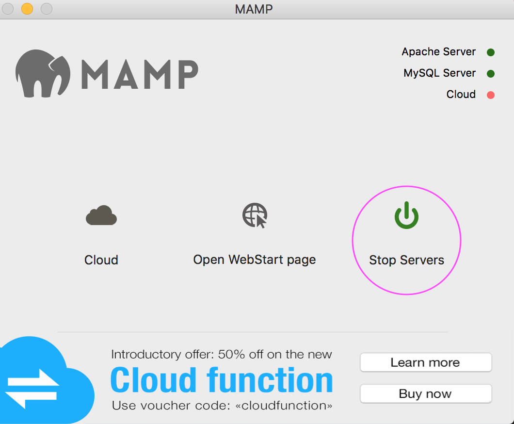
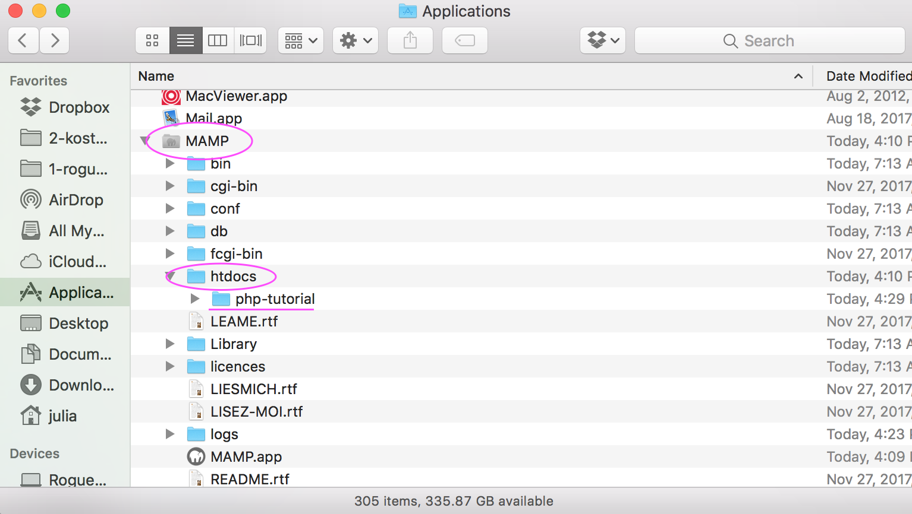
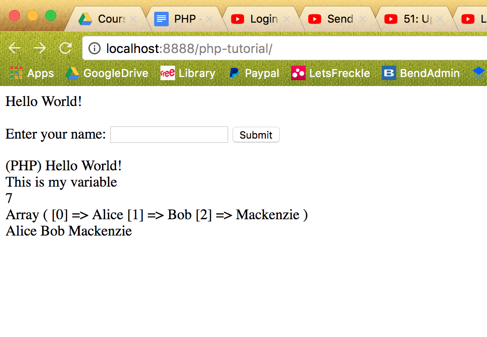

Based off of this Youtube PHP [Tutorial](https://www.youtube.com/watch?v=ZdP0KM49IVk) by Jake Wright

<html>
    
Note: in order for this project to run, need to have installed and started server from Mamp...

    
    
Have the folder installed in this Mamp folder in Applications...

    
    
which would reveal this...

    
</html>